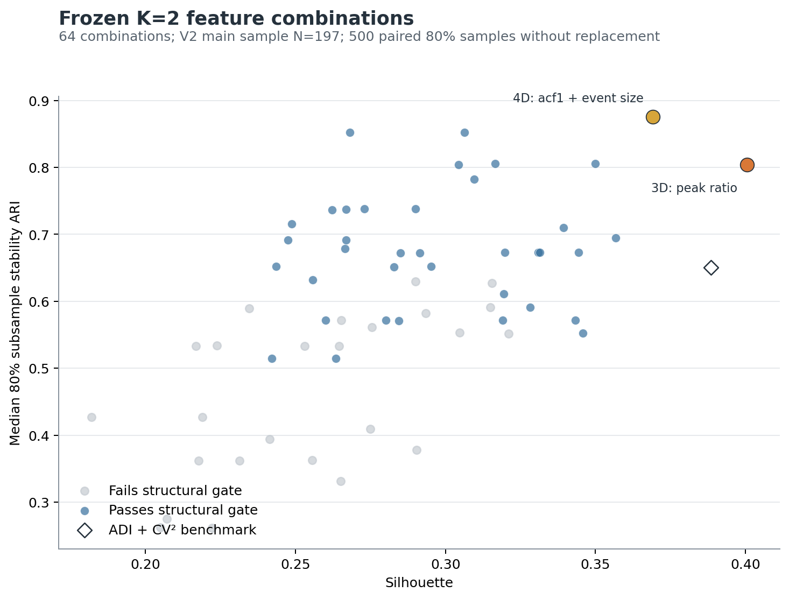
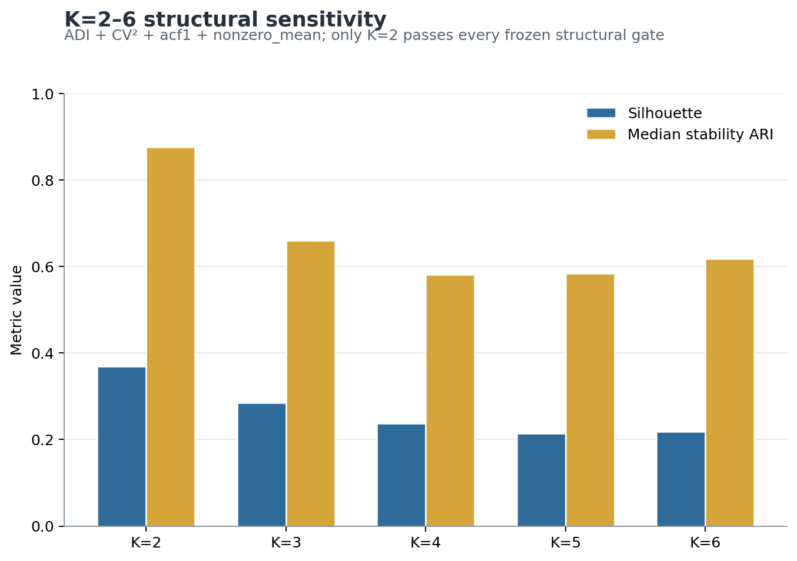
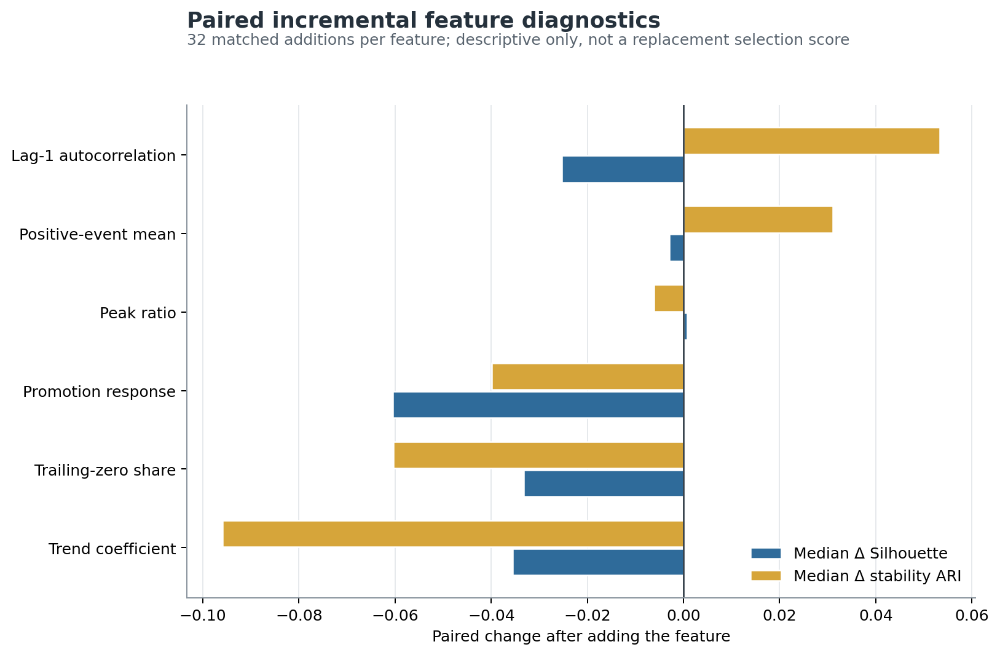
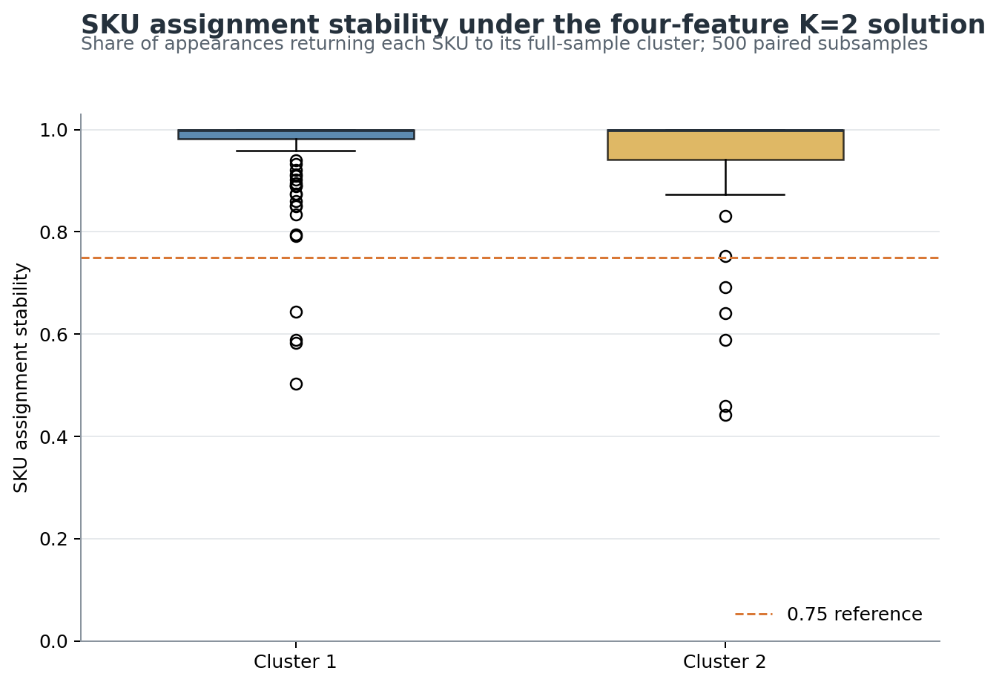

# 业务导向聚类工程结果审阅 V3.0

分析日期：2026-09-01  
证据性质：**回顾性方法开发，可用于下游验证方案选择，但不是新增样本上的独立确认性证据。**

## 1. 直接结论

1. 在冻结的 8 项主池、64 个合规组合中，正式 Pareto 前沿保留两个方案：
   - `ADI + CV2 + acf1 + nonzero_mean`；
   - `ADI + CV2 + peak_ratio`。
2. 建议把 `ADI + CV2 + acf1 + nonzero_mean` 作为后续预测价值检验的**优先主方案**，Ward 固定 `K=2`。
3. `ADI + CV2 + peak_ratio` 保留为聚类敏感性对照，不用于替代主方案。
4. K=3–6 在三个复核特征集上均未通过冻结结构门，不能作为正式聚类结构。
5. 促销响应、趋势、末端连续零值、年度季节性和近似熵均已实际计算；它们没有被遗漏，但现有证据不足以让其进入主聚类距离。

这里的“建议”只确定下一阶段应验证哪套聚类输入。预测 MASE 尚未参与本次选择，也不得在之后反向修改本结论。



## 2. Pareto 候选比较

| 特征组合 | 维度 | Silhouette | 稳定性 ARI 中位数 | ARI P10 | 最小簇 Jaccard 中位数 | 簇规模 | Raw–V2 ARI | ≥5–≥10 ARI | Ward–K-means ARI | 归属稳定性<0.75 |
| --- | ---: | ---: | ---: | ---: | ---: | --- | ---: | ---: | ---: | ---: |
| ADI + CV2 | 2 | 0.3885 | 0.6505 | 0.4611 | 0.7704 | 123 / 74 | 0.4027 | 0.7410 | 0.6822 | 33 |
| **ADI + CV2 + acf1 + nonzero_mean** | **4** | **0.3692** | **0.8757** | **0.6310** | **0.9219** | **120 / 77** | **0.9199** | **0.6018** | **0.9004** | **9** |
| ADI + CV2 + peak_ratio | 3 | 0.4005 | 0.8039 | 0.3173 | 0.8584 | 138 / 59 | 1.0000 | 0.5118 | 0.5685 | 25 |

四维方案没有取得最高 Silhouette，但其结构稳定性和算法一致性明显更强：

- 稳定性 ARI 中位数比峰值三维方案高 0.0718；
- 稳定性 P10 高 0.3137，说明不利重抽样下的崩溃风险更低；
- Ward–K-means ARI 为 0.9004，而峰值方案为 0.5685；
- 归属稳定性低于 0.75 的 SKU 为 9 个，而峰值方案为 25 个；
- Raw–V2 ARI 仍为 0.9199，说明 V2 修正没有重构四维分群；
- `acf1` 和 `nonzero_mean` 分别表达短期持续性与正需求事件规模，和 ADI、CV2 的构念区分较清楚。

峰值方案的优势是维度更少且 Silhouette 更高，但 `peak_ratio` 与 CV2 的 Spearman 相关为 0.8795，存在重复放大事件波动维度的风险；同时其样本门槛和算法敏感性更大。因此不把它设为主方案。

两个 Pareto 方案之间的聚类 ARI 仅为 0.4775，说明它们并非同一分群的轻微变体。峰值方案必须保留在附录敏感性中，而不能被静默删除。

## 3. K=2–6 结果

在优先四维方案下：

| K | Silhouette | 稳定性 ARI 中位数 | 最小簇 Jaccard 中位数 | 最小簇规模 | 结构门 |
| ---: | ---: | ---: | ---: | ---: | --- |
| **2** | **0.3692** | **0.8757** | **0.9219** | **77** | **通过** |
| 3 | 0.2854 | 0.6605 | 0.5300 | 29 | 不通过 |
| 4 | 0.2368 | 0.5804 | 0.0000 | 15 | 不通过 |
| 5 | 0.2135 | 0.5841 | 0.4100 | 15 | 不通过 |
| 6 | 0.2185 | 0.6175 | 0.4167 | 15 | 不通过 |

K=3 的第三簇虽然不是极小簇，但最弱簇的 Jaccard 中位数只有 0.5300，无法在 80% 子样本中稳定复现。K=4–6 的最弱簇稳定性更差。二维理论基准和峰值三维对照下也只有 K=2 通过全部结构门。因此本轮 `K=2` 是有数据支持的操作结构，不是为了方便而主观指定。



## 4. 六项补充特征实际贡献

每项补充特征都在其他补充维度保持不变时完成 32 组成对比较。下表是描述性诊断，不是新的综合评分。

| 补充特征 | Silhouette 中位变化 | 稳定性 ARI 中位变化 | 两项同时改善比例 | Pareto 方案包含数 |
| --- | ---: | ---: | ---: | ---: |
| acf1 | -0.0254 | +0.0533 | 25.0% | 1 |
| nonzero_mean | -0.0030 | +0.0311 | 40.6% | 1 |
| peak_ratio | +0.0007 | -0.0062 | 46.9% | 1 |
| promo_response_index | -0.0605 | -0.0399 | 0.0% | 0 |
| trailing_zero_share | -0.0333 | -0.0604 | 15.6% | 0 |
| trend_coef | -0.0355 | -0.0959 | 12.5% | 0 |

促销响应并非“不要了”：它按用户提供的 Amazon 月份权重计算，并校正了不同 SKU 观察窗口的月份覆盖。结果是 32/32 组成对比较中，加入该变量没有一次同时改善 Silhouette 与稳定性。它适合作为簇画像和后续促销敏感性描述，不适合在当前样本中进入主 Ward 距离。该变量仍只是促销日历代理，不能解释为折扣、广告投入或促销因果效果。



## 5. 年度季节性与近似熵敏感性

主样本中有 32 个 SKU 仅有 30 周记录，因此年度季节性没有被强行填零。仅在 165 个观察周数不少于 104 的 SKU 中比较：

- 四维方案本身：Silhouette 0.3607、稳定性 ARI 中位数 0.6650、最小簇 Jaccard 0.7719；
- 加入 `seasonality_idx`：Silhouette 0.3084、稳定性 ARI 中位数 0.5802、最小簇 Jaccard 0.7222。

年度季节性没有增强四维结构，加入后反而未通过 0.75 的簇级稳定性门。二维基准加季节性虽然出现 0.9691 的 ARI 中位数，但 P10 仅 0.0450，说明结果呈现严重的重抽样不稳定，不能只看中位数采用。

近似熵加入四维方案后，Silhouette 从 0.3692 降至 0.2865，稳定性 ARI 中位数从 0.8757 降至 0.5074，最小簇 Jaccard 从 0.9219 降至 0.6370。技术敏感性不支持其进入主方案。

## 6. 优先四维 K=2 的簇画像

以下为原始尺度中位数，方括号内为 1,000 次 SKU 重抽样的 95% 百分位区间。

| 画像 | 簇1 | 簇2 |
| --- | ---: | ---: |
| SKU 数量 | 120（60.9%） | 77（39.1%） |
| ADI | 3.21 [2.73, 3.60] | 10.38 [8.67, 11.56] |
| CV2 | 0.517 [0.473, 0.603] | 0.255 [0.205, 0.303] |
| 正需求事件均值 | 3.71 [3.48, 4.26] | 1.60 [1.48, 1.67] |
| acf1 | 0.599 [0.562, 0.649] | 0.326 [0.268, 0.370] |
| 全周平均需求 | 1.23 [0.93, 1.57] | 0.156 [0.125, 0.202] |
| 正需求周数 | 31 [25, 36] | 10 [9, 12] |
| 期间总需求 | 111.5 [89.98, 135.06] | 16 [13, 21] |
| 末端零值占比 | 0.0148 [0.0036, 0.0370] | 0.0962 [0.0769, 0.1827] |
| 促销响应指数 | 1.080 [1.004, 1.146] | 1.085 [1.027, 1.206] |

建议的论文画像名称：

- **簇1：相对活跃—持续规模型。** 相对更频繁，单次需求规模更高，短期持续性更强，期间影响也更大。它更有资格进入预测价值检验，但不预先绑定 SES；正式模型池仍比较 MA4_proxy、Naive、SES 和 ADIDA2。
- **簇2：低频稀疏—低规模型。** 需求发生间隔长、事件规模小、短期持续性较弱、末端休眠比例更高。应先证明预测能稳定优于简单基准，否则优先规则管理；其中高影响例外 SKU 仍需单独验证 ADIDA2 或人工复核。

两簇的促销响应区间高度重叠，现阶段不能据此命名“促销型簇”。簇2的 CV2 反而较低，含义是其正需求事件本身相对稳定，但发生得很少；不能把“低 CV2”误写成“总体需求稳定”。



## 7. 验证结果

- 原始工作簿 SHA256：`ece008d42c9dd6ea11e4a0c8f6d828c2cb037df1d837ea233587f115491786b6`；
- 242 个唯一 SKU；主样本 197；严格样本 148；长历史样本 165；
- 64 个冻结组合均成功计算，无重复组合、无无效结果、无非有限主特征值；
- 独立使用原始逐组合函数重新计算四维方案的 500 次稳定性，正式值与复算值逐项完全一致；
- Raw–V2、主样本–严格样本及 Ward–K-means ARI 均已独立复算；
- 34 项单元测试通过，包括共享变换等价性、64 组合枚举、V2 边界、恒等关系、ADIDA2 和无未来数据泄漏。

验证评级：**可带限制用于论文阶段性结果与下一阶段预测设计。**

## 8. 必须保留的限制

1. 当前数据和既有四维结果在本轮前已经被查看，因此不能称为独立确认性检验；8 周新增数据后的确认性复跑才承担该作用。
2. 四维方案的主样本–严格样本 ARI 为 0.6018，只能称为中等一致，不得写成“对样本门槛高度稳健”。
3. 两个 Pareto 方案之间 ARI 较低，说明特征选择仍会改变具体 SKU 归属；应在附录保留峰值方案结果。
4. 促销指标来自月份权重代理，没有 SKU 级折扣、广告、库存或缺货记录，不能做促销因果解释。
5. 年度季节性只覆盖 165 个长历史 SKU，不能推广到全部 197 个主样本。
6. 本阶段只确定聚类输入与 K，不证明聚类一定能提高预测。是否值得部署必须由 Rolling-Origin 和一次性留出窗口回答。

## 9. 可复现命令

```bash
python -m src.business_feature_pipeline --config config/analysis_business_features.yaml
python -m src.business_feature_diagnostics --config config/analysis_business_features.yaml
python -m src.business_feature_plots --output-root outputs/business_features_v3
pytest -q
```

核心可审阅文件：

- `outputs/business_features_v3/clustering/feature_grid_k2_500.csv`
- `outputs/business_features_v3/clustering/post_selection_k2_to_k6.csv`
- `outputs/business_features_v3/clustering/feature_increment_diagnostics.csv`
- `outputs/business_features_v3/clustering/pareto_candidate_robustness.csv`
- `outputs/business_features_v3/clustering/candidate_profile_intervals.csv`
- `outputs/business_features_v3/clustering/recommended_main_cluster_assignments.csv`

