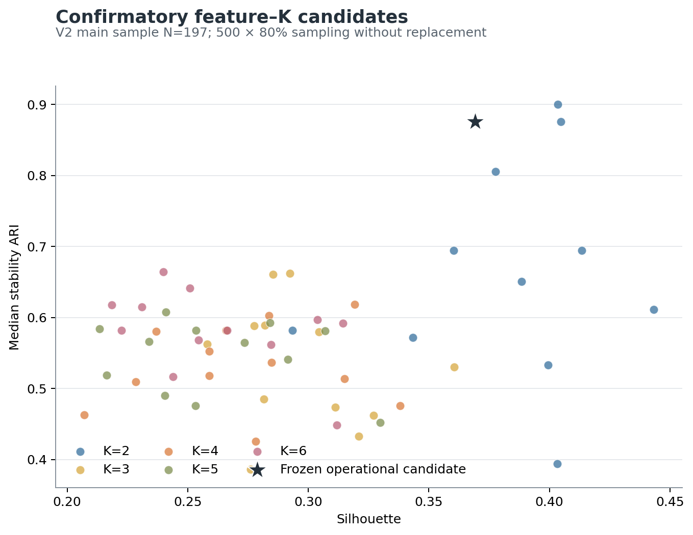
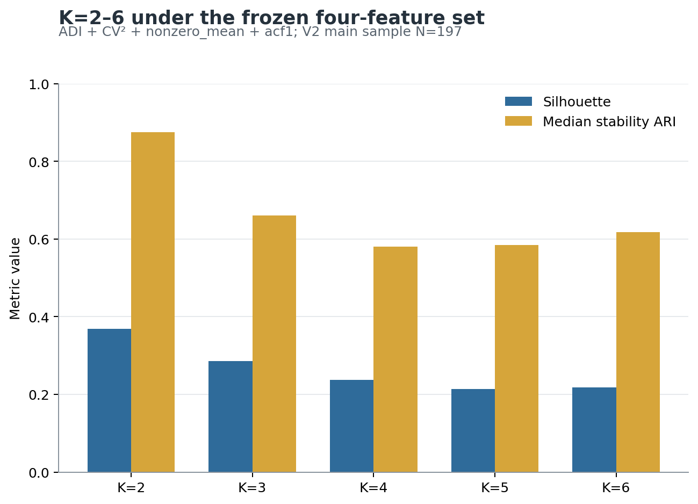
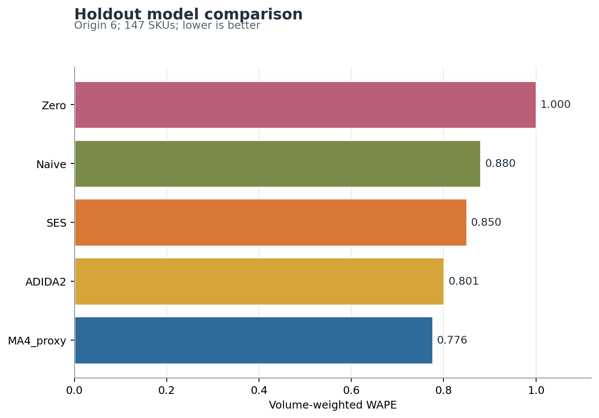
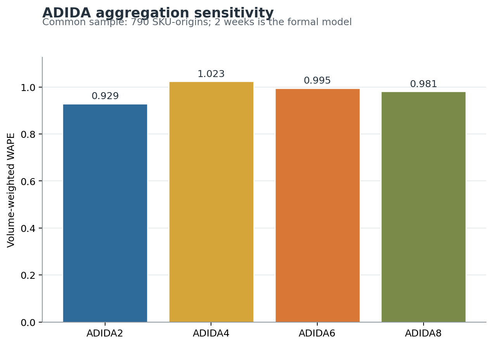
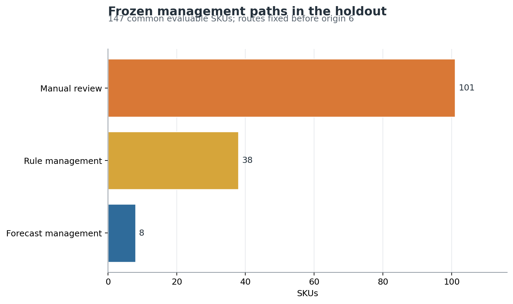
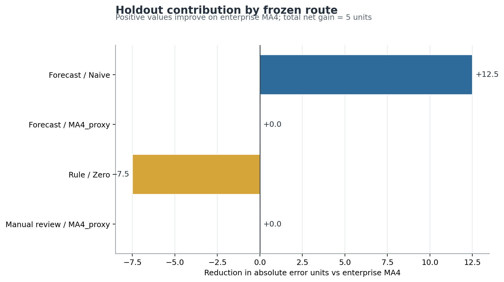

# 德国 Amazon SKU 聚类与轻量预测验证报告

生成口径：协议 1.0 及修订 1.1–1.4；随机种子 42；原始工作簿只读。  
正式运行命令：`python -m src.pipeline --config config/analysis.yaml`

## 一、结论先行

1. **完整期间主结果为四维 Ward K=2**：`ADI+CV2+nonzero_mean+acf1`，N=197。Silhouette=0.369，500 次 80% 子样本稳定性 ARI 中位数=0.876，簇规模 1:120;2:77。
2. **K=3 不通过**：它同时被 K=2 的 Silhouette（0.369 对 0.285）和稳定性 ARI（0.876 对 0.660）支配；最弱匹配簇 Jaccard 仅 0.530；Raw/V2 ARI=0.779<0.80。因此 SBA/TSB 未进入模型池。
3. **首个预测起点前冻结结果与完整期间不同**：应用簇级稳定性门槛后为 `ADI + CV2 + std_sales`、K=2，N=130。初始遗漏门槛的未约束结果为二维 K=5，已永久保留并按修订 1.4 披露。
4. **ADIDA2 不是本数据的全局优胜模型**：开发期相对 MA4_proxy 的 SKU 配对 Mean MASE 差为 +0.314，95% 区间 [0.150, 0.494]，正值表示更差。没有 SKU 通过 ADIDA2 的最终生产路由门槛。
5. **分层方案没有形成足以支持全面部署的增益**：最终留出中，方案 A 的销量加权 WAPE=0.7760，方案 B=0.7745；Mean MASE 从 2.496 降到 2.483，配对差区间 [-0.150, 0.136] 跨 0。净绝对误差仅改善 5.0 个单位。
6. **小型企业建议**：继续以 MA4_proxy 为默认；只对 5 个冻结 Naive 白名单做低风险试点；ADIDA2 保留为影子模型；SES 暂不上线；高影响不稳定 SKU 继续人工复核。当前不值得部署完整的“聚类驱动多模型路由”。

## 二、证据分级

### A. 已确认方法

- 德国站、SKU×完整周粒度；跨年拆分周先合并，同一 ISO 周累计覆盖 7 天后方可进入分析。
- V2 清洗、正销量周 ≥5 主样本、≥10 严格样本、Ward、K=2–6、500 次 80% 无放回子样本稳定性。
- 正式预测模型池：MA4_proxy、Naive、SES、ADIDA2；Zero 只作为预测价值与规则管理基准。
- 6 个不重叠 8 周窗口；前 5 个开发，第 6 个一次性留出。

### B. 阶段性参考

- 先前文档的原始合计 30,229、V2 合计约 30,933、增量约 704 只作为排错参考。
- 初始未约束预测期选择 `ADI + CV²`、K=5 是实现缺口暴露结果，不是最终操作方案。

### C. 经本次检验后的判断

- 四维 K=2 得到最多支持，但 ≥5/≥10 ARI 只有 0.602，因此仍有样本门槛敏感性。
- K=3、SBA/TSB、SES 路由和 ADIDA2 生产路由均未通过。
- 轻量分层只对少量 SKU 有局部价值，整体经济价值尚不能成立。

## 三、数据审计与 V2 复现

| 项目 | 结果 |
|---|---:|
| 原始 SHA256 | `ece008d42c9dd6ea11e4a0c8f6d828c2cb037df1d837ea233587f115491786b6` |
| 工作表 | 2024-2025_销量, 2026_销量 |
| 日期范围 | 2024-01-01 至 2026-07-27 |
| 唯一 SKU | 242 |
| 原始 SKU-区间单元 | 25,032 |
| 合并后 SKU-周 | 24,932 |
| 完整 SKU-周 | 24,790 |
| 不完整 SKU-周 | 142 |
| 跨表拆分周 SKU-周 | 100 |
| 非数值 / 缺失 / 负值 | 0 / 0 / 0 |
| 阻断问题 | 0 |

V2 正式复现：529 个候选区间、43 个修正区间、30 个 SKU、168 个 SKU-周。关键计数与历史参考完全一致。当前严格合并完整 ISO 周后，Raw 合计为 30,248.00，V2 为 30,943.75，增加 695.75（2.30%）。这与历史 30,229 / 30,933 / +704 略有差异；本研究没有调节规则追平，差异优先解释为跨年分片或历史数据版本口径。

完整期间样本数：正销量周 ≥2 为 230，≥5 为 197，≥10 为 148。两个精确特征恒等关系均为 0 个失败。

### SKU 宇宙变化

2024–2025 工作表有 195 个 SKU，2026 工作表有 147 个；仅 100 个重叠，95 个仅在前表，47 个仅在 2026 表。这导致第 3 个窗口有 95 个测试期不完整，第 4–6 个窗口有 95 个训练末端中断；它是预测结论的重要限制，不能把缺失周静默补零。

## 四、特征与 K

确认性特征均以 ADI、CV² 为锚点，完整网格同时保留含 `median_sales` 的敏感性结果。`median_sales` 在 197 个主样本中 169 个为 0，形成近似 ADI≈2 的机械阈值；其 `ADI+CV²+median_sales` K=2 虽达到 Silhouette 0.573、稳定性 ARI 1.000，但不具备主特征资格。

### 四维冻结特征的 K=2–6

| K | Silhouette | 稳定性 ARI 中位数 | ARI P10 | 簇规模 |
| --- | --- | --- | --- | --- |
| 2 | 0.369 | 0.876 | 0.631 | 1:120;2:77 |
| 3 | 0.285 | 0.660 | 0.471 | 1:91;2:29;3:77 |
| 4 | 0.237 | 0.580 | 0.434 | 1:91;2:29;3:62;4:15 |
| 5 | 0.213 | 0.584 | 0.434 | 1:44;2:47;3:29;4:62;5:15 |
| 6 | 0.219 | 0.617 | 0.446 | 1:17;2:27;3:47;4:29;5:62;6:15 |

K=3 的数值判定条件中，未被 K=2 支配、全部簇 Jaccard≥0.75、Raw/V2 ARI≥0.80 和独立非残差解释均失败；簇规模和 ≥5/≥10 ARI 条件通过。结论是 **K=2 主结果、K=3 探索性失败结果**。

### K=2 原始尺度画像

| 簇 | N | ADI中位数 | CV²中位数 | 正销量均值 | acf1 | 零占比 | 总销量 | 正销量周 |
| --- | --- | --- | --- | --- | --- | --- | --- | --- |
| 1 | 120 | 3.214 | 0.517 | 3.713 | 0.599 | 0.689 | 111.500 | 31.000 |
| 2 | 77 | 10.385 | 0.255 | 1.600 | 0.326 | 0.904 | 16.000 | 10.000 |

- 簇 1（120）：较活跃的中度间歇需求，需求事件规模和总影响较高，序列持续性更强。
- 簇 2（77）：高度间歇、低规模需求；正需求事件自身的 CV²较低，但发生很稀疏。

稳健性：Ward/K-means ARI=0.900，Raw/V2 ARI=0.920；SKU 归属稳定性中位数=0.997，P10=0.874，有 9 个 SKU 低于 0.75。≥5/≥10 ARI=0.602，提示严格样本下边界移动明显。

## 五、预测实验与年度可用性

首个预测起点为 2025-09-01，只使用截至 2025-08-25 的数据。修订 1.4 前未约束结果为 `ADI + CV2` K=5，最弱簇 Jaccard=0.439；应用既有簇级门槛后，冻结为 `ADI + CV2 + std_sales` K=2，簇 1:70;2:60，Silhouette=0.420，稳定性 ARI=0.815。

6 个起点分别为：2025-09-01, 2025-10-27, 2025-12-22, 2026-02-16, 2026-04-13, 2026-06-08。预测覆盖过至少一次的唯一 SKU 为 242；最终留出共同可评价为 147。最终留出有 16 个 SKU 的 MASE 分母为 0，均保留 MAE/WAPE 而未填造 MASE。

## 六、模型结果与 ADIDA2

### 全部 6 个起点汇总

| 模型 | Mean MASE | Median MASE | MASE<1 | MAE | 销量加权WAPE | Bias |
| --- | --- | --- | --- | --- | --- | --- |
| MA4_proxy | 4.046 | 1.584 | 38.1% | 2.023 | 0.912 | -0.033 |
| Naive | 3.979 | 1.262 | 45.1% | 2.011 | 0.907 | -0.007 |
| SES | 4.088 | 1.590 | 37.7% | 2.044 | 0.921 | 0.011 |
| ADIDA2 | 4.266 | 1.683 | 33.8% | 2.089 | 0.942 | -0.047 |
| Zero | 3.545 | 1.139 | 47.8% | 2.218 | 1.000 | -1.000 |

Zero 的 Mean MASE 较低但销量加权 WAPE=1，说明大量稀疏 SKU 会让未加权 MASE 偏向零预测；不能用单一平均 MASE 决定全量模型。

开发期配对结果：ADIDA2 相对 MA4_proxy 的 Mean MASE 差为 +0.314，95%区间 [0.150, 0.494]；相对 Naive 为 +0.570，[0.145, 1.106]。两项均显示 ADIDA2 全局更差。

### ADIDA2 适用画像

- 开发期共有 784 个可比 SKU-起点；ADIDA2 在 167 个上优于 Naive，在 183 个上优于 MA4_proxy。
- 10 个 SKU 至少 3 次同时优于 Naive 与 MA4_proxy。它们在第 5 起点的中位画像为：ADI=3.26、正销量周=36.5、nonzero_mean=4.38、acf1=0.61。这更接近“中度间歇、事件规模不低、具有一定持续性”，不是极端稀疏。
- 最终留出 ADIDA2 分别在 53 个 SKU 上优于 Naive、45 个上优于 MA4_proxy，其中同时优于两者为 34 个；但留出销量加权 WAPE=0.801，高于 MA4_proxy 的 0.776，且无 SKU 满足全部生产路由条件。
- 在共同 790 个 SKU-起点上，2 周聚合的销量加权 WAPE=0.929，低于 4/6/8 周的 1.023, 0.995, 0.981。较长聚合的 Mean MASE有时更低，但 Median MASE、MAE和销量加权 WAPE更差，支持 2 周只作为影子模型的正式尺度。

## 七、管理路径与方案 A/B

前 5 个起点冻结的全 SKU 路由为：预测管理 8、规则管理 121、人工复核 113。在最终留出的 147 个共同 SKU 中：预测管理 8、规则管理 38、人工复核 101。预测管理只包含 5 个 Naive 和 3 个 MA4_proxy；SES、ADIDA2 均为 0。

| 方案 | N | Mean MASE | Median MASE | MASE<1 | MAE | 销量加权WAPE | Bias |
| --- | --- | --- | --- | --- | --- | --- | --- |
| A: 统一MA4 | 147 | 2.496 | 1.423 | 36.6% | 2.085 | 0.776 | -0.138 |
| B: 轻量分层 | 147 | 2.483 | 1.405 | 38.2% | 2.080 | 0.774 | -0.164 |

方向上，方案 B 的 Mean、Median MASE和 WAPE均略好，但幅度很小，Bias 更负。贡献拆解显示：5 个 Naive 路由改善 12.5 个绝对误差单位；38 个 Zero 规则路由损失 7.5；其余回退 MA4 不变，净改善仅 5.0。绝对变化的前 10 个 SKU 占 93.9%，说明结果高度集中，而非普遍改善。

## 八、小型企业落地判断

**当前不建议部署完整分层机制。** 可落地的最小版本是：

1. MA4_proxy 作为默认模型和统一回退。
2. 仅对 `frozen_routes_before_holdout.csv` 中 5 个 Naive SKU 做白名单试点；每期重新验证，失效即回退。
3. ADIDA2 对 10 个开发期反复改善候选做影子运行，不进入自动采购或库存决策。
4. 留出期 101 个高影响/不稳定 SKU 人工复核；38 个低影响、信息不足 SKU 规则管理。
5. 先解决年度 SKU 宇宙断裂与业务字段缺失，再评估是否值得自动化扩展。

具体维护矩阵见 `reports/implementation_matrix.md`。

## 九、限制与仍需补充的数据

- 两个年度工作表只有 100 个 SKU 重叠，回测的可比总体发生结构性变化。
- V2 是需求代理，不是真实销量恢复；历史总量参考与当前严格完整周口径存在小差异。
- ≥5/≥10 的 K=2 ARI 仅 0.602，完整期间画像不能被解释为绝对稳定分类。
- `median_sales` 资格修订发生在 5 次预检之后；操作稳定性门槛推广发生在看到预测前聚类网格之后，均已披露但仍有结果知情风险。
- 只有销量，没有促销、库存、缺货、持有成本、采购提前期、MOQ、服务水平、采购价或毛利。
- 因此本报告只能判断预测误差与维护复杂度，不能声称利润、库存成本或缺货成本显著改善。
- 最终留出只有一个 8 周窗口；置信区间较宽，需新增滚动数据后再验证。

## 十、复现与交付

- 正式命令：`python -m src.pipeline --config config/analysis.yaml`
- 测试：`pytest -q`
- 主要原始表：`01_原始数据/德国Amazon_SKU周度数据_原始合并版_未清洗 (1).xlsx`
- 完整网格：`outputs/clustering/feature_k_grid_500.csv`
- K=3 判定：`outputs/clustering/k3_acceptance.json`
- 回测明细：`outputs/forecast/rolling_origin_predictions.csv`
- 冻结路由：`outputs/forecast/frozen_routes_before_holdout.csv`
- 留出比较：`outputs/forecast/holdout_scheme_comparison_summary.csv`

所有失败结果、未约束 K=5、MASE 不可计算记录、原始/V2差异和年度 SKU 断裂均保留，没有为追求更理想结论而调整规则。
