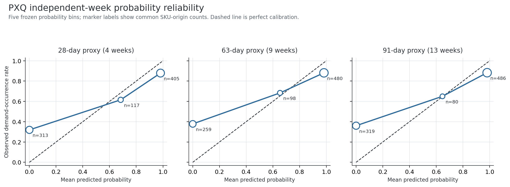

# p×q 发生概率的三周期历史验证报告

协议版本：V4.1；随机种子：42；生成日期：2026-09-05。  
运行：`python -m src.pxq_probability_v4_1 --config config/pxq_probability_v4_1.yaml`  
绘图：`python -m src.pxq_probability_plots_v4_1 --output-root outputs/pxq_probability_v4_1`  
校验：`python -m src.validate_pxq_probability_v4_1 --config config/pxq_probability_v4_1.yaml`

## 一、结论先行

1. **从论文问题看，发生概率比“每周固定预测多少件”更适合回答 SKU 是否值得
   进入预测管理。** 但它只回答未来周期内是否至少发生一次需求，不能替代周期总量
   或采购数量预测。
2. **近期周发生率经独立周换算后具有明显的风险区分能力。** 在四方法共同样本上，
   28/63/91天代理的 Brier 分数分别为0.209、0.206、0.211，均为四种冻结方法中
   最低；ROC AUC 分别为0.808、0.813、0.813。相对企业总体周期频率基准，Brier
   skill 分别为28.6%、34.8%、30.7%。
3. **当前数值不能直接当作“校准后的真实概率”。** 三个周期的平均概率均低估实际
   发生率6.0–7.6个百分点，均未通过预冻结的5个百分点校准门槛；60天代理相对
   总体基准的SKU层面配对区间还跨0。因此三个周期的总体概率价值门槛均未通过。
4. **最严重的问题是0和接近1的过度确定性。** 预测为0的组中，未来仍有31.9%、
   37.8%、36.1%的SKU–起点实际发生需求；最高概率组的平均预测约98%，实际约
   88%。这也是核心方法 Log loss 高达4.53–5.03的原因。
5. **聚类在这里有实际用途：识别概率可信度，而不是绑定算法。** 相对活跃持续簇
   三周期的校准差均在±4.1个百分点内、Brier为0.099–0.146；低信息层的概率严重
   低估实际发生率19.9–33.0个百分点，不适合自动化概率决策。
6. **当前落地方式应是“风险评分+数量预测双列展示”。** 保留V4.0的MA4/p×q周期
   总量结果，同时把本轮数值标为“独立周假设下的发生风险估计”，用于排序和人工
   关注，不用于自动补货阈值。正式称为概率前，需要在新增数据上验证预先冻结的
   校准方法。

## 二、研究问题与准确表述

对SKU `i`、预测起点`t`和周期`H`，本轮目标为：

`Z(i,t,H) = 1{未来H周原始销量合计 > 0}`。

V4.0中的：

`p_recent = 最近H周正需求周数 / H`

只是近期**周发生率**。只有在未来各周发生概率恒定且条件独立时，才可换算为：

`P_H = 1 - (1-p_recent)^H`。

因此报告统一称其为“PXQ独立周换算概率”。该假设并未由公式本身证明，必须通过
校准和区分能力回测判断。

## 三、样本与复用边界

- 沿用V4.0的4/9/13周，即28/63/91天代理，以及每周期6个互不重叠历史起点；
- 沿用同一原始文件、V2规则、动态Ward K=2簇标签和测试期实际总量；
- 没有重跑MA4_proxy、Naive、SES、ADIDA2或p×q数量模型；
- 只为新概率问题重新读取每个起点前的连续V2训练片段；
- 目标来自测试期原始销量，测试期没有进入任何概率计算；
- 与V4.0已有的2,279个非缺失`p_recent`逐行核对，最大绝对差为
  `1.11e-16`。

概率分支不需要`q`，因此训练期全零的SKU仍可给出`p_recent=0`。其原生覆盖高于
V4.0完整p×q数量分解。

| 周期 | 发生率原生SKU–起点 | 四方法共同SKU–起点 | 共同样本唯一SKU | V4.0 p×q数量可用 |
| --- | ---: | ---: | ---: | ---: |
| 28天代理 | 882 | 835 | 147 | 759 |
| 63天代理 | 884 | 837 | 242 | 795 |
| 91天代理 | 932 | 885 | 195 | 725 |

91天代理另有47个SKU–起点因截至当时不足13个连续训练周，连近期周发生率也不可
计算；公平比较还要求至少2个完整历史周期。

## 四、四种冻结概率方法

1. `PXQ_independence`：`1-(1-p_recent)^H`；
2. `SKU_block_frequency`：该SKU历史完整H周期中发生需求的比例；
3. `Profile_block_frequency`：当期同一管理画像历史周期事件的汇总比例；
4. `Overall_block_frequency`：企业全部共同样本历史周期事件的汇总比例。

所有历史周期均从预测起点向过去切分、互不重叠，最早不足H周的余数舍弃。没有
指数平滑、贝叶斯缩减、伪计数、事后校准或分类阈值优化。

## 五、总体概率表现

以下结果全部来自四方法共同SKU–起点，Brier越低越好。

| 周期 | 方法 | 观察发生率 | 平均预测概率 | 校准差 | Brier | Log loss | ROC AUC |
| --- | --- | ---: | ---: | ---: | ---: | ---: | ---: |
| 28天 | PXQ独立周换算 | 63.23% | 57.20% | -6.03pp | **0.209** | 4.873 | **0.808** |
| 28天 | SKU周期频率 | 63.23% | 38.74% | -24.50pp | 0.282 | 2.072 | 0.707 |
| 28天 | 画像周期频率 | 63.23% | 34.89% | -28.35pp | 0.289 | 0.805 | 0.674 |
| 28天 | 企业总体频率 | 63.23% | 38.55% | -24.69pp | 0.293 | 0.781 | 0.525 |
| 63天 | PXQ独立周换算 | 70.25% | 64.00% | -6.25pp | **0.206** | 4.527 | **0.813** |
| 63天 | SKU周期频率 | 70.25% | 36.00% | -34.25pp | 0.354 | 3.136 | 0.593 |
| 63天 | 画像周期频率 | 70.25% | 35.11% | -35.14pp | 0.329 | 0.905 | 0.613 |
| 63天 | 企业总体频率 | 70.25% | 35.66% | -34.59pp | 0.317 | 0.834 | 0.651 |
| 91天 | PXQ独立周换算 | 67.34% | 59.74% | -7.61pp | **0.211** | 5.029 | **0.813** |
| 91天 | SKU周期频率 | 67.34% | 35.22% | -32.12pp | 0.351 | 4.472 | 0.606 |
| 91天 | 画像周期频率 | 67.34% | 35.22% | -32.12pp | 0.317 | 0.893 | 0.645 |
| 91天 | 企业总体频率 | 67.34% | 35.22% | -32.12pp | 0.304 | 0.809 | 0.696 |

长期历史周期频率明显低于后续实际发生率，说明旧历史对当前需求状态反应较慢；这
支持“近期信息重要”，但不能据此断言发生率上升的业务原因。2024–2025与2026的
SKU宇宙断裂仍是重要替代解释。

## 六、可靠性检验：为何不能直接称为精确概率

固定五等宽区间实际只出现三个档位，因为`p_recent`由H周中的整数计数产生，经过
非线性换算后迅速靠近0或1。

| 周期 | 预测档 | SKU–起点 | 平均预测 | 实际发生率 | 解释 |
| --- | --- | ---: | ---: | ---: | --- |
| 28天 | 预测为0 | 313 | 0.0% | 31.9% | 对无近期需求SKU过度悲观 |
| 28天 | 最高档 | 405 | 98.2% | 87.9% | 对近期活跃SKU过度确定 |
| 63天 | 预测为0 | 259 | 0.0% | 37.8% | 对无近期需求SKU过度悲观 |
| 63天 | 最高档 | 480 | 98.3% | 88.1% | 对近期活跃SKU过度确定 |
| 91天 | 预测为0 | 319 | 0.0% | 36.1% | 对无近期需求SKU过度悲观 |
| 91天 | 最高档 | 486 | 98.1% | 88.3% | 对近期活跃SKU过度确定 |

所以低Brier和高AUC主要说明它能把SKU分成较高、较低风险，而不是每个百分数都已
可信。错误的0或1会被Log loss重罚，这正是本轮不能省略的警示信号。

## 七、配对稳定性与预冻结门槛

差值定义为“PXQ独立周换算Brier − 基准Brier”，负值有利于核心方法。置信区间
在SKU层面进行1,000次配对重抽样。

| 周期 | 对比基准 | 平均差 | 95%区间 | 胜出起点 |
| --- | --- | ---: | --- | ---: |
| 28天 | SKU周期频率 | -0.071 | [-0.102, -0.039] | 6/6 |
| 28天 | 画像周期频率 | -0.079 | [-0.111, -0.050] | 6/6 |
| 28天 | 企业总体频率 | -0.080 | [-0.119, -0.047] | 6/6 |
| 63天 | SKU周期频率 | -0.095 | [-0.126, -0.068] | 6/6 |
| 63天 | 画像周期频率 | -0.065 | [-0.103, -0.032] | 5/6 |
| 63天 | 企业总体频率 | -0.023 | [-0.067, 0.020] | 5/6 |
| 91天 | SKU周期频率 | -0.122 | [-0.146, -0.096] | 6/6 |
| 91天 | 画像周期频率 | -0.093 | [-0.117, -0.066] | 6/6 |
| 91天 | 企业总体频率 | -0.075 | [-0.103, -0.044] | 6/6 |

| 周期 | 起点门槛 | 配对区间门槛 | 绝对校准差≤5pp | 总判定 |
| --- | --- | --- | --- | --- |
| 28天 | 通过（6/6） | 通过 | 未通过（6.03pp） | 未通过 |
| 63天 | 通过（5/6） | 未通过 | 未通过（6.25pp） | 未通过 |
| 91天 | 通过（6/6） | 通过 | 未通过（7.61pp） | 未通过 |

63天总体行级Brier改善较大，但SKU等权、跨起点平均后的配对区间跨0，说明改善受
不同SKU出现次数和历史阶段影响；不能只报告汇总Brier而省略配对结果。

## 八、按管理画像的结果

下表只列核心方法，属于描述性分层；没有预设簇专属概率模型。

| 周期 | 管理画像 | N | 实际发生率 | 平均预测 | 校准差 | Brier | AUC |
| --- | --- | ---: | ---: | ---: | ---: | ---: | ---: |
| 28天 | 相对活跃持续 | 449 | 77.7% | 76.1% | -1.7pp | 0.146 | 0.828 |
| 28天 | 低频稀疏 | 224 | 49.1% | 44.4% | -4.7pp | 0.295 | 0.684 |
| 28天 | 低信息 | 162 | 42.6% | 22.7% | -19.9pp | 0.266 | 0.697 |
| 63天 | 相对活跃持续 | 354 | 79.7% | 83.0% | +3.3pp | 0.113 | 0.889 |
| 63天 | 低频稀疏 | 284 | 65.8% | 66.4% | +0.6pp | 0.201 | 0.800 |
| 63天 | 低信息 | 199 | 59.8% | 26.8% | -33.0pp | 0.379 | 0.655 |
| 91天 | 相对活跃持续 | 310 | 82.9% | 86.9% | +4.0pp | 0.099 | 0.872 |
| 91天 | 低频稀疏 | 227 | 67.4% | 75.3% | +7.9pp | 0.164 | 0.831 |
| 91天 | 低信息 | 348 | 53.4% | 25.4% | -28.1pp | 0.340 | 0.668 |

这组结果支持以下管理解释，但不支持模型绑定：

- **相对活跃持续**：发生风险排序和总体校准较好，可进入预测管理，同时另看周期
  数量；
- **低频稀疏**：63天表现最平衡，28天区分较弱、91天偏高，只适合作为风险提示；
- **低信息**：近期无需求不等于未来无需求，当前概率严重低估，优先规则管理或
  人工复核，不能把0概率作为停采依据。

## 九、与V4.0数量预测如何并列

概率和数量应保持两个输出，不可混写：

| 输出 | 回答的问题 | 当前证据 |
| --- | --- | --- |
| `P_H=1-(1-p)^H` | 周期内会不会至少发生一次需求 | 有区分力，但未充分校准 |
| `H×p×q` | 周期总需求量的简化期望 | 部分周期有潜力，未稳定替代MA4 |
| MA4_proxy | 企业简单数量基准 | 继续作为默认回退方案 |

严格的两阶段数量框架为：

`E(D_H) = P(D_H>0) × E(D_H | D_H>0)`。

本轮没有估计第二项的“周期条件需求量”，因此不能把周正需求均值`q`直接代入并
宣称已完成两阶段概率模型。

## 十、小型企业落地建议

建议系统暂时增加三列影子信息，而不改变现有补货逻辑：

1. `发生风险_28天代理`、`发生风险_63天代理`、`发生风险_91天代理`；
2. 同时显示V4.0的周期总量估计和MA4_proxy；
3. 对`p_recent=0`但历史单次需求影响大的SKU强制人工复核；
4. 对低信息SKU显示“概率未校准/证据不足”，不得显示为“确定无需求”；
5. 不在缺少提前期、MOQ、服务水平和成本数据时设自动采购概率阈值。

如果要把风险分数升级为可直接解释的概率，下一版本应先冻结一个透明的校准方法，
再使用新增数据检验；本轮不得根据已看到的可靠性曲线回头调参。已经安排的8周后
复跑只足以形成28天代理的新数据验证；63天和91天代理分别至少需要9周和13周的
新增完整数据。

## 十一、质量控制与限制

- 原始文件SHA256与V4.1协议一致；
- 概率预测明细10,651行，四方法共同SKU–起点2,557个；
- 13项独立输出校验全部通过；
- 所有概率在`[0,1]`内，二元目标、Brier、独立周公式和历史区间计数均逐行复核；
- 4/9/13周是28/63/91天代理，不是精确自然日预测；
- V2值是需求代理，测试目标使用原始可观测销量；若销量零实际源于缺货，本研究无
  库存状态可辨识；
- 2024–2025与2026的SKU宇宙变化会影响跨期基准和配对结果；
- 本轮是回顾性方法开发，不能声称外部有效性或因果关系；
- 缺少库存、提前期、MOQ、服务水平、成本、价格、毛利和SKU淘汰标识，不能评价
  自动补货阈值、利润或库存成本。

最终结论应写为：**发生概率视角比周度固定数量更贴合SKU预测管理分层；近期周
发生率是有区分力的风险信号，但未经校准的独立周换算存在严重的0/1过度确定性，
目前只能作为风险评分，不能作为精确概率或自动采购依据。**
